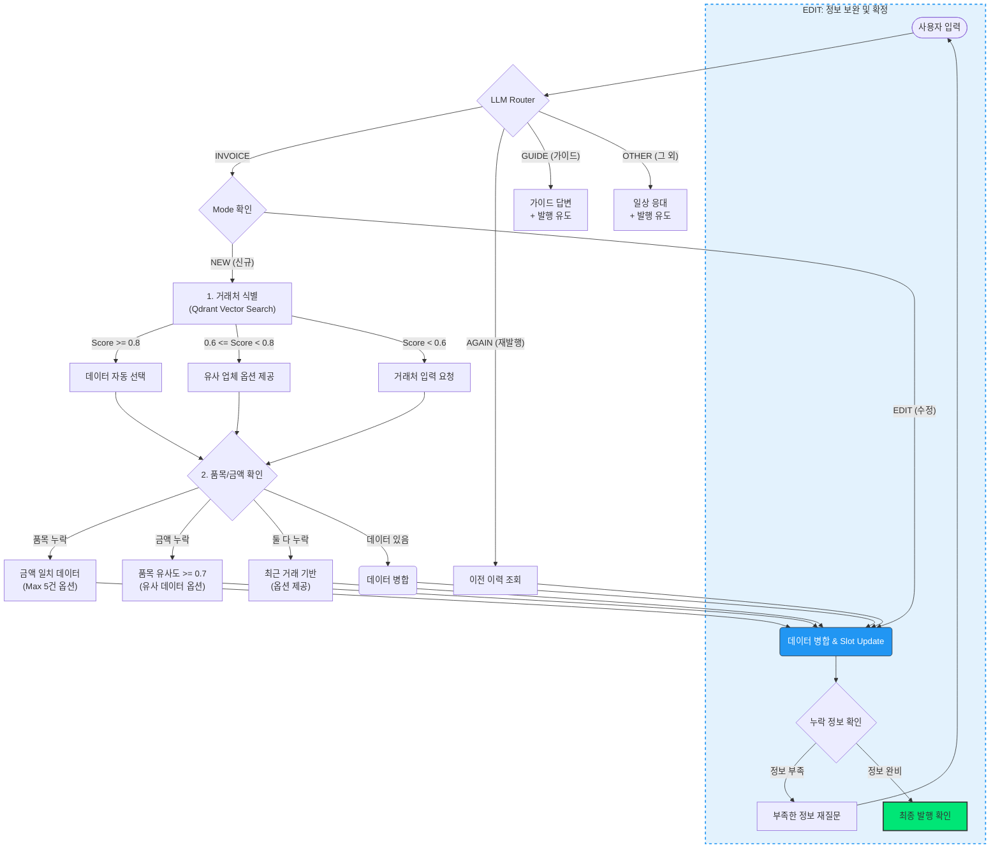

```mermaid
flowchart TD
    User([사용자 입력]) --> Router{LLM Router}

    %% 1. INVOICE - 분기
    Router -- "INVOICE" --> InvoiceType{Mode 확인}

    %% ------------------------------------------------
    %% A. NEW Process (데이터 수집 단계)
    %% ------------------------------------------------
    InvoiceType -- "NEW (신규)" --> PartnerCheck["1. 거래처 식별<br/>(Qdrant Vector Search)"]

    PartnerCheck -- "Score >= 0.8" --> PartnerFound[데이터 자동 선택]
    PartnerCheck -- "0.6 <= Score < 0.8" --> PartnerSelect[유사 업체 옵션 제공]
    PartnerCheck -- "Score < 0.6" --> PartnerInput[거래처 입력 요청]

    %% 거래처 확보 후 품목/금액 체크
    PartnerFound & PartnerSelect & PartnerInput --> ItemCheck{2. 품목/금액 확인}

    ItemCheck -- "품목 누락" --> MatchAmount["금액 일치 데이터<br/>(Max 5건 옵션)"]
    ItemCheck -- "금액 누락" --> MatchItem["품목 유사도 >= 0.7<br/>(유사 데이터 옵션)"]
    ItemCheck -- "둘 다 누락" --> MatchRecent["최근 거래 기반<br/>(옵션 제공)"]
    ItemCheck -- "데이터 있음" --> DataReady(데이터 병합)

    %% ------------------------------------------------
    %% B. EDIT Process (슬롯 필링 및 발행) - 모든 길은 여기로 통함
    %% ------------------------------------------------
    MatchAmount & MatchItem & MatchRecent & DataReady --> MergeData
    
    InvoiceType -- "EDIT (수정)" --> MergeData
    
    subgraph EDIT_PHASE [EDIT: 정보 보완 및 확정]
        MergeData(데이터 병합 & Slot Update) --> CheckSlots{누락 정보 확인}
        CheckSlots -- "정보 부족" --> AskUser[부족한 정보 재질문]
        AskUser --> User
        CheckSlots -- "정보 완비" --> FinalConfirm[최종 발행 확인]
    end

    %% ------------------------------------------------
    %% C. OTHERS
    %% ------------------------------------------------
    Router -- "AGAIN (재발행)" --> FetchHistory[이전 이력 조회] --> MergeData
    Router -- "GUIDE (가이드)" --> ShowGuide["가이드 답변<br/>+ 발행 유도"]
    Router -- "OTHER (그 외)" --> ChitChat["일상 응대<br/>+ 발행 유도"]

    %% Style
    style EDIT_PHASE fill:#e3f2fd,stroke:#2196f3,stroke-width:2px,stroke-dasharray: 5 5
    style MergeData fill:#2196f3,color:#fff,stroke:#333
    style FinalConfirm fill:#00e676,stroke:#333,stroke-width:2px
```
